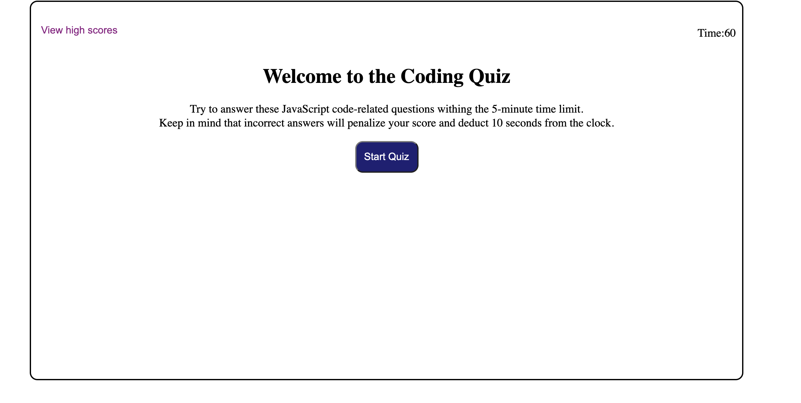
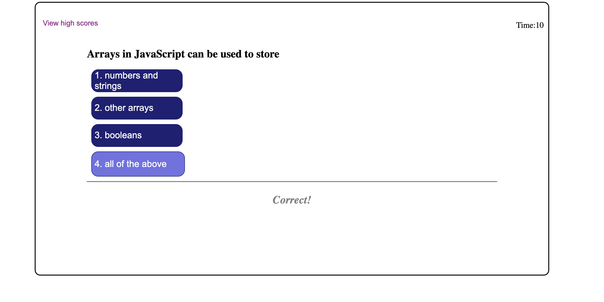
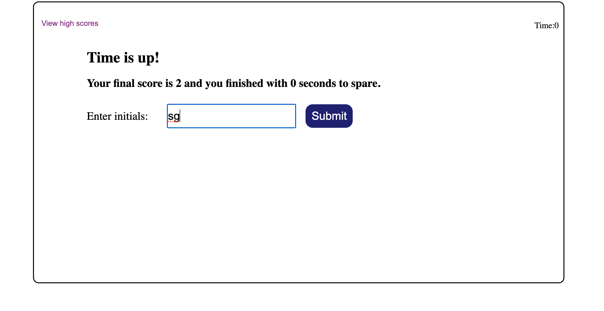
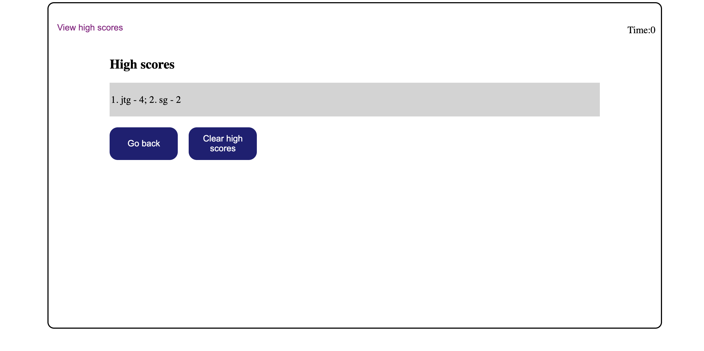
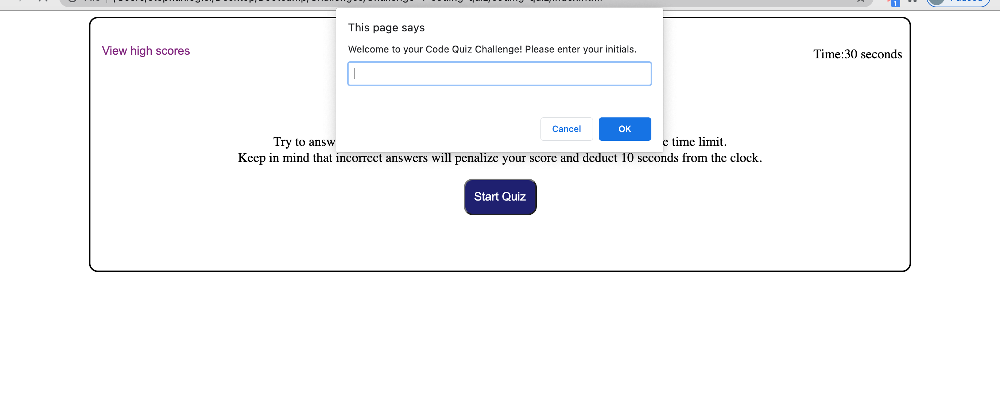
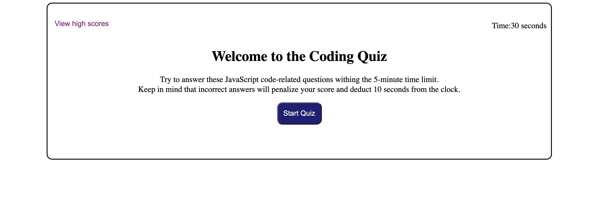
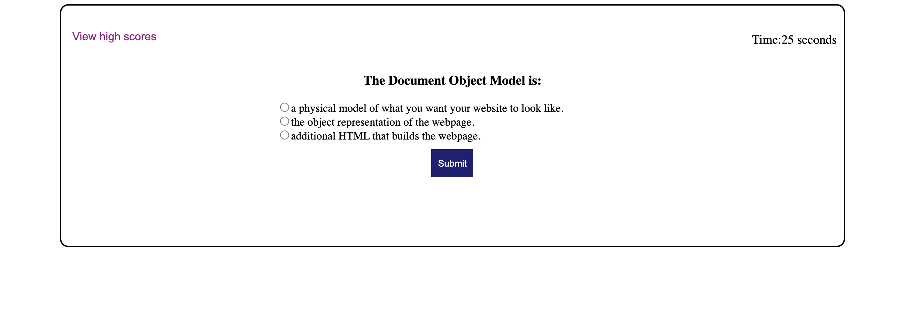
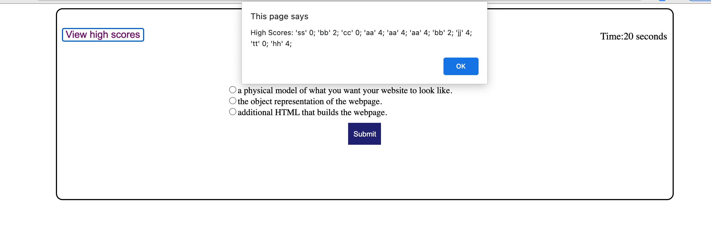
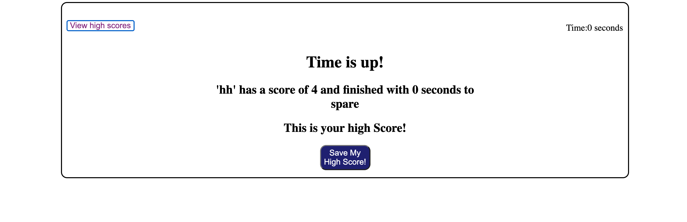

# Stephanie's Coding Quiz

## Description 

This web application generates a multiple-choice timed JavaScript coding quiz. It prompts user for their initals and when they hit start the timer starts counting down. They have 60 seconds to answer 5 multiple choice questions. If a question is answered incorrectly, then 10 seconds is deducted from the timer. The quiz is over when all the questions are answered or when the timer runs out of time. When the quiz is over, the user is told whether they have achieved a personal high score. The user is then asked to enter their initials. They can then view the high scores and choose to try the quiz again or if they would like to clear the stored high scores. 

This JavaScript code contains skills I recently learned including accessing localStorage to save and retrieve date, using addEventListener and at the same time understanding where the actual listening was occurring (how events are delegated), using if/else statements and for loops, and writing into HTML elements with JavaScript.

## Screenshots of web application 

## Screenshots of web application when I first completed it (and had even completed this README.md). When I was going over the challenge in Canvas right before I was to turn it in, I saw that the mock-up was not just a picture of the welcome screen of the test, but a video rotating through the other screens. I included them, because I put a lot of time into re-working the entire challenge and just had to mention it!

## Link

[Link to Stephanie's Coding Quiz applicaton](https://sgiel.github.io/coding-quiz/)

